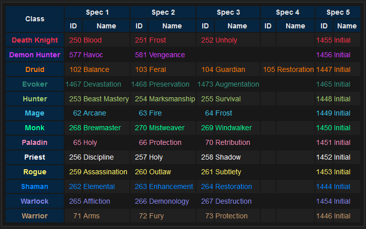

# UNIT

---

> ## is

#### Parameters

-   `UNIT1`: The first unit to compare.
-   `UNIT2`: The second unit to compare.

#### Returns `BOOL`

-   `true` if the two units are the same, `false` otherwise.

#### _Example:_

=== "DSL"

    ```lua
    {ACTION, "UNIT1.is(UNIT2)", UNIT1},
    ```

=== "Lua Code"

    ```lua
    _A.DSL:Get("is")("UNIT1", "UNIT2")
    ```

=== "Lua Mode"

    ```lua
    UNIT1:Is(UNIT2)
    ```

---

> ## groupSize
>
> _`groupSize || group.members || num.members`_

#### Parameters

-   None

#### Returns `NUMBER`

-   The total number of group members (including the player). Returns `0` if not in a group.

#### _Example:_

=== "DSL"

    ```lua
    {ACTION, "groupSize > 1"},
    ```

=== "Lua Code"

    ```lua
    _A.DSL:Get("groupSize")()
    ```

---

> ## IsSolo

#### Parameters

-   None

#### Returns `BOOL`

-   `true` if the player is not in a group, `false` otherwise.

#### _Example:_

=== "DSL"

    ```lua
    {ACTION, "IsSolo"},
    ```

=== "Lua Code"

    ```lua
    _A.DSL:Get("IsSolo")()
    ```

---

> ## IsParty

#### Parameters

-   None

#### Returns `BOOL`

-   `true` if the player is in a party (1-5 members), `false` otherwise.

#### _Example:_

=== "DSL"

    ```lua
    {ACTION, "IsParty"},
    ```

=== "Lua Code"

    ```lua
    _A.DSL:Get("IsParty")()
    ```

---

> ## IsRaid

#### Parameters

-   None

#### Returns `BOOL`

-   `true` if the player is in a raid (more than 5 members), `false` otherwise.

#### _Example:_

=== "DSL"

    ```lua
    {ACTION, "IsRaid"},
    ```

=== "Lua Code"

    ```lua
    _A.DSL:Get("IsRaid")()
    ```

---

> ## groupType

#### Parameters

-   None

#### Returns `NUMBER`

-   Returns a numeric value representing the group type:
    -   `3` = RAID
    -   `2` = Party
    -   `1` = SOLO

#### _Example:_

=== "DSL"

    ```lua
    {ACTION, "group.type==3"},
    ```

=== "Lua Code"

    ```lua
    _A.DSL:Get("groupType")() == 3
    ```

---

> ## ingroup

#### Parameters

-   `UNIT`: The unit to check for group membership.

#### Returns `BOOL`

-   `true` if the specified unit is in the player's party or raid group, `false` otherwise.

#### _Example:_

=== "DSL"

    ```lua
    {ACTION, "ingroup", UNIT},
    ```

=== "Lua Code"

    ```lua
    _A.DSL:Get("ingroup")("UNIT")
    ```

=== "Lua Mode"

    ```lua
    UNIT:Ingroup()
    ```

---

> ## incdmg

#### Parameters

-   `UNIT`: The unit to calculate incoming damage for.
-   `seconds`: The time frame in seconds to calculate incoming damage for (default is 3 seconds).

#### Returns `NUMBER`

-   The total damage taken by the unit in the specified time frame, or 0 if the target doesn't exist.

#### _Example:_

=== "DSL"

    ```lua
    {ACTION, "UNIT.incdmg(3) > 10000", UNIT},
    ```

=== "Lua Code"

    ```lua
    _A.DSL:Get("incdmg")("UNIT", "3") > 10000
    ```

=== "Lua Mode"

    ```lua
    UNIT:Incdmg(3) > 10000
    ```

---

> ## incdmg.phys

#### Parameters

-   `UNIT`: The unit for which to calculate incoming physical damage.
-   `seconds`: The time frame in seconds to calculate incoming physical damage for (default is 3 seconds).

#### Returns `NUMBER`

-   The total damage taken by the unit in the specified time frame, or 0 if the target doesn't exist.

#### _Example:_

=== "DSL"

    ```lua
    {ACTION, "UNIT.incdmg.phys(3) > 10000", UNIT},
    ```

=== "Lua Code"

    ```lua
    _A.DSL:Get("incdmg.phys")("UNIT", "3") > 10000
    ```

=== "Lua Mode"

    ```lua
    UNIT:IncdmgPhys(3) > 10000
    ```

---

> ## incdmg.magic

#### Parameters

-   `UNIT`: The unit for which to calculate incoming magic damage.
-   `seconds`: The time frame in seconds to calculate incoming magic damage for (default is 3 seconds).

#### Returns `NUMBER`

-   The total damage taken by the unit in the specified time frame, or 0 if the target doesn't exist.

#### _Example:_

=== "DSL"

    ```lua
    {ACTION, "UNIT.incdmg.magic(3) > 10000", UNIT},
    ```

=== "Lua Code"

    ```lua
    _A.DSL:Get("incdmg.magic")("UNIT", "3") > 10000
    ```

=== "Lua Mode"

    ```lua
    UNIT:IncdmgMagic(3) > 10000
    ```

---

> ## incdmg.reset

-   This condition resets the incoming damage counter for the specified unit.

#### Parameters

-   `UNIT`: The unit to reset the incoming damage counter for.

#### Returns `NIL`

-   This condition does not return a value.

#### _Example:_

=== "DSL"

    ```lua
    {ACTION, "UNIT.incdmg.reset", UNIT},
    ```

=== "Lua Code"

    ```lua
    _A.DSL:Get("incdmg.reset")("UNIT")
    ```

=== "Lua Mode"

    ```lua
    UNIT:IncdmgReset()
    ```

---

> ## incdmg.phys.reset

-   This condition resets the incoming physical damage counter for the specified unit.

#### Parameters

-   `UNIT`: The unit to reset the incoming physical damage counter for.

#### Returns `NIL`

-   This condition does not return a value.

#### _Example:_

=== "DSL"

    ```lua
    {ACTION, "UNIT.incdmg.phys.reset", UNIT},
    ```

=== "Lua Code"

    ```lua
    _A.DSL:Get("incdmg.phys.reset")("UNIT")
    ```

=== "Lua Mode"

    ```lua
    UNIT:IncdmgPhysReset()
    ```

---

> ## incdmg.magic.reset

-   This condition resets the incoming magic damage counter for the specified unit.

#### Parameters

-   `UNIT`: The unit to reset the incoming magic damage counter for.

#### Returns `NIL`

-   This condition does not return a value.

#### _Example:_

=== "DSL"

    ```lua
    {ACTION, "UNIT.incdmg.magic.reset", UNIT},
    ```

=== "Lua Code"

    ```lua
    _A.DSL:Get("incdmg.magic.reset")("UNIT")
    ```

=== "Lua Mode"

    ```lua
    UNIT:IncdmgMagicReset()
    ```

---

> ## boss
>
> _`boss || isBoss`_

#### Parameters

-   `UNIT`: The unit to check for boss status.

#### Returns `BOOL`

-   `true` if the unit is a boss, `false` otherwise.

#### _Example:_

=== "DSL"

    ```lua
    {ACTION, "UNIT.boss", UNIT},
    ```

=== "Lua Code"

    ```lua
    _A.DSL:Get("boss")("UNIT")
    ```

=== "Lua Mode"

    ```lua
    UNIT:Boss()
    ```

---

> ## elite

#### Parameters

-   `UNIT`: The unit to check for elite classification.

#### Returns `BOOL`

-   `true` if the unit has an elite classification, `false` otherwise.

#### _Example:_

=== "DSL"

    ```lua
    {ACTION, "UNIT.elite", UNIT},
    ```

=== "Lua Code"

    ```lua
    _A.DSL:Get("elite")("UNIT")
    ```

=== "Lua Mode"

    ```lua
    UNIT:Elite()
    ```

---

> ## classification

#### Parameters

-   `UNIT`: The unit to check for classification.
-   `classif`: The classification string to compare with. Multiple classifications can be separated by spaces or commas.

    | **`classif`** |
    | ------------- |
    | worldboss     |
    | rareelite     |
    | elite         |
    | rare          |
    | normal        |
    | trivial       |
    | minus         |

#### Returns `BOOL`

-   `true` if the unit's classification matches any of the given classifications, `false` otherwise.

#### _Example:_

=== "DSL"

    ```lua
    {ACTION, "UNIT.classification(rare)", UNIT},
    ```

=== "Lua Code"

    ```lua
    _A.DSL:Get("classification")("UNIT", "rare")
    ```

=== "Lua Mode"

    ```lua
    UNIT:Classification("rare")
    ```

---

> ## worldboss

#### Parameters

-   `UNIT`: The unit to check for world boss classification.

#### Returns `BOOL`

-   `true` if the unit is classified as a world boss, `false` otherwise.

#### _Example:_

=== "DSL"

    ```lua
    {ACTION, "UNIT.worldboss", UNIT},
    ```

=== "Lua Code"

    ```lua
    _A.DSL:Get("worldboss")("UNIT")
    ```

=== "Lua Mode"

    ```lua
    UNIT:Worldboss()
    ```

---

> ## id

#### Parameters

-   `UNIT`: The unit whose ID will be checked.
-   `ID_STRING`: The expected numeric ID, passed as a string.

#### Returns `BOOL`

-   `true` if the unit's actual numeric ID matches the numeric ID parsed from the `ID_STRING`, `false` otherwise.

#### _Example:_

=== "DSL"

    ```lua
    {ACTION, "UNIT.id(1589)", UNIT},
    ```

=== "Lua Code"

    ```lua
    _A.DSL:Get("id")("UNIT", "1589")
    ```

=== "Lua Mode"

    ```lua
    UNIT:Id(1589)
    ```

---

> ## reaction

#### Parameters

-   `UNIT`: The unit to check for reaction level.

#### Returns `NUMBER`

-   The reaction level of the unit towards the player:
    -   `1` = Hated
    -   `2` = Hostile
    -   `3` = Unfriendly
    -   `4` = Neutral
    -   `5` = Friendly
    -   `6` = Honored
    -   `7` = Revered
    -   `8` = Exalted
    -   `0` = Unknown or unit doesn't exist

#### _Example:_

=== "DSL"

    ```lua
    {ACTION, "UNIT.reaction >= 4", UNIT},
    ```

=== "Lua Code"

    ```lua
    _A.DSL:Get("reaction")("UNIT") >= 4
    ```

=== "Lua Mode"

    ```lua
    UNIT:Reaction() >= 4
    ```

---

> ## hasReaction

#### Parameters

-   `UNIT`: The unit to check for the reaction.
-   `reaction`: The expected reaction level (can be a number or string name: "hated", "hostile", "unfriendly", "neutral", "friendly", "honored", "revered", "exalted").

#### Returns `BOOL`

-   `true` if the unit has the expected reaction level, `false` otherwise.

#### _Example:_

=== "DSL"

    ```lua
    {ACTION, "UNIT.hasReaction(hostile)", UNIT},
    {ACTION, "UNIT.hasReaction(2)", UNIT},
    ```

=== "Lua Code"

    ```lua
    _A.DSL:Get("hasReaction")("UNIT", "hostile")
    _A.DSL:Get("hasReaction")("UNIT", "2")
    ```

=== "Lua Mode"

    ```lua
    UNIT:HasReaction("hostile")
    UNIT:HasReaction(2)
    ```

---

> ## threat

#### Parameters

-   `UNIT`: The unit to check for threat percentage towards the player.

#### Returns `NUMBER`

-   The unit's threat percentage against the player. At 100% the player will become the primary target.

#### _Example:_

=== "DSL"

    ```lua
    {ACTION, "UNIT.threat >= 80", UNIT},
    ```

=== "Lua Code"

    ```lua
    _A.DSL:Get("threat")("UNIT") >= 80
    ```

=== "Lua Mode"

    ```lua
    UNIT:Threat() >= 80
    ```

---

> ## aggro

#### Parameters

-   `UNIT`: The unit to check for aggro on the player.

#### Returns `BOOL`

-   `true` if the target has aggro on the player, `false` otherwise.

#### _Example:_

=== "DSL"

    ```lua
    {ACTION, "UNIT.aggro", UNIT},
    ```

=== "Lua Code"

    ```lua
    _A.DSL:Get("aggro")("UNIT")
    ```

=== "Lua Mode"

    ```lua
    UNIT:Aggro()
    ```

---

> ## UnitThreatSituation

#### Parameters

-   `UNIT1`: The first unit to check threat situation.
-   `UNIT2`: The second unit to check threat situation against.

#### Returns `NUMBER | NIL`

-   Returns the threat situation status between two units, or `nil` if either unit doesn't exist.
    -   `0` = Unit does not have threat
    -   `1` = Unit has threat but is not tanking (another unit has higher threat)
    -   `2` = Unit has highest threat (is tanking)
    -   `3` = Unit has threat and is tanking, but another unit is about to gain threat

#### _Example:_

=== "DSL"

    ```lua
    {ACTION, "UNIT1.UnitThreatSituation(UNIT2) >= 2", UNIT1},
    ```

=== "Lua Code"

    ```lua
    _A.DSL:Get("UnitThreatSituation")("UNIT1", "UNIT2")
    ```

=== "Lua Mode"

    ```lua
    UNIT1:UnitThreatSituation(UNIT2)
    ```

---

> ## speed

#### Parameters

-   `UNIT`: The unit whose speed to retrieve.

#### Returns `NUMBER`

-   The speed of the unit in yards per second. Returns `0` if the unit doesn't exist.

#### _Example:_

=== "DSL"

    ```lua
    {ACTION, "UNIT.speed > 0", UNIT},
    ```

=== "Lua Code"

    ```lua
    _A.DSL:Get("speed")("UNIT") > 0
    ```

=== "Lua Mode"

    ```lua
    UNIT:Speed() > 0
    ```

---

> ## moving

#### Parameters

-   `UNIT`: The unit to check if is currently moving

#### Returns `BOOL`

-   `true` if the unit is moving, `false` otherwise.

#### _Example:_

=== "DSL"

    ```lua
    {ACTION, "UNIT.moving", UNIT},
    ```

=== "Lua Code"

    ```lua
    _A.DSL:Get("moving")("UNIT")
    ```

=== "Lua Mode"

    ```lua
    UNIT:Moving()
    ```

---

> ## IsMovingForward

#### Parameters

-   `UNIT`: The unit to check if it is moving forward.

#### Returns `BOOL`

-   `true` if the unit is moving forward, `false` otherwise.

#### _Example:_

=== "DSL"

    ```lua
    {ACTION, "UNIT.IsMovingForward", UNIT},
    ```

=== "Lua Code"

    ```lua
    _A.DSL:Get("IsMovingForward")("UNIT")
    ```

=== "Lua Mode"

    ```lua
    UNIT:IsMovingForward()
    ```

---

> ## IsMovingBackward

#### Parameters

-   `UNIT`: The unit to check if it is moving backward.

#### Returns `BOOL`

-   `true` if the unit is moving backward, `false` otherwise.

#### _Example:_

=== "DSL"

    ```lua
    {ACTION, "UNIT.IsMovingBackward", UNIT},
    ```

=== "Lua Code"

    ```lua
    _A.DSL:Get("IsMovingBackward")("UNIT")
    ```

=== "Lua Mode"

    ```lua
    UNIT:IsMovingBackward()
    ```

---

> ## IsStrafeLeft

#### Parameters

-   `UNIT`: The unit to check if it is strafing left.

#### Returns `BOOL`

-   `true` if the unit is strafing left, `false` otherwise.

#### _Example:_

=== "DSL"

    ```lua
    {ACTION, "UNIT.IsStrafeLeft", UNIT},
    ```

=== "Lua Code"

    ```lua
    _A.DSL:Get("IsStrafeLeft")("UNIT")
    ```

=== "Lua Mode"

    ```lua
    UNIT:IsStrafeLeft()
    ```

---

> ## IsStrafeRight

#### Parameters

-   `UNIT`: The unit to check if it is strafing right.

#### Returns `BOOL`

-   `true` if the unit is strafing right, `false` otherwise.

#### _Example:_

=== "DSL"

    ```lua
    {ACTION, "UNIT.IsStrafeRight", UNIT},
    ```

=== "Lua Code"

    ```lua
    _A.DSL:Get("IsStrafeRight")("UNIT")
    ```

=== "Lua Mode"

    ```lua
    UNIT:IsStrafeRight()
    ```

---

> ## predictPosition

#### Parameters

-   `UNIT`: The unit whose position is to be predicted.
-   `seconds`: The time in seconds into the future for which to predict the unit's position.

#### Returns `NUMBER, NUMBER, NUMBER | NIL`

-   The predicted `x, y, z` coordinates of the unit, or `nil` if the prediction cannot be made.

#### _Example:_

=== "DSL"

    ```lua
    {ACTION, "UNIT.predictPosition(3)", UNIT},
    ```

=== "Lua Code"

    ```lua
    _A.DSL:Get("predictPosition")("UNIT", "3")
    ```

=== "Lua Mode"

    ```lua
    UNIT:PredictPosition(3)
    ```

---

> ## currentSpeed

#### Parameters

-   `UNIT`: The unit whose current speed to retrieve.

#### Returns `NUMBER`

-   The current speed of the unit in yards per second.

#### _Example:_

=== "DSL"

    ```lua
    {ACTION, "UNIT.currentSpeed > 5", UNIT},
    ```

=== "Lua Code"

    ```lua
    _A.DSL:Get("currentSpeed")("UNIT") > 5
    ```

=== "Lua Mode"

    ```lua
    UNIT:CurrentSpeed() > 5
    ```

---

> ## walkSpeed

#### Parameters

-   `UNIT`: The unit whose walking speed to retrieve.

#### Returns `NUMBER`

-   The walking speed of the unit in yards per second.

#### _Example:_

=== "DSL"

    ```lua
    {ACTION, "UNIT.walkSpeed > 2", UNIT},
    ```

=== "Lua Code"

    ```lua
    _A.DSL:Get("walkSpeed")("UNIT") > 2
    ```

=== "Lua Mode"

    ```lua
    UNIT:WalkSpeed() > 2
    ```

---

> ## runSpeed

#### Parameters

-   `UNIT`: The unit whose running speed to retrieve.

#### Returns `NUMBER`

-   The running speed of the unit in yards per second.

#### _Example:_

=== "DSL"

    ```lua
    {ACTION, "UNIT.runSpeed > 7", UNIT},
    ```

=== "Lua Code"

    ```lua
    _A.DSL:Get("runSpeed")("UNIT") > 7
    ```

=== "Lua Mode"

    ```lua
    UNIT:RunSpeed() > 7
    ```

---

> ## backSpeed

#### Parameters

-   `UNIT`: The unit whose backward speed to retrieve.

#### Returns `NUMBER`

-   The backward speed of the unit in yards per second.

#### _Example:_

=== "DSL"

    ```lua
    {ACTION, "UNIT.backSpeed > 3", UNIT},
    ```

=== "Lua Code"

    ```lua
    _A.DSL:Get("backSpeed")("UNIT") > 3
    ```

=== "Lua Mode"

    ```lua
    UNIT:BackSpeed() > 3
    ```

---

> ## swimSpeed

#### Parameters

-   `UNIT`: The unit whose swimming speed to retrieve.

#### Returns `NUMBER`

-   The swimming speed of the unit in yards per second.

#### _Example:_

=== "DSL"

    ```lua
    {ACTION, "UNIT.swimSpeed > 4", UNIT},
    ```

=== "Lua Code"

    ```lua
    _A.DSL:Get("swimSpeed")("UNIT") > 4
    ```

=== "Lua Mode"

    ```lua
    UNIT:SwimSpeed() > 4
    ```

---

> ## target

#### Parameters

-   `UNIT1`: The unit whose target will be checked.
-   `UNIT2`: The unit to compare the target against.

#### Returns `BOOL`

-   `true` if the target of the specified unit1 matches the given unit2, `false` otherwise.

#### _Example:_

=== "DSL"

    ```lua
    {ACTION, "UNIT1.target(UNIT2)", UNIT1},
    ```

=== "Lua Code"

    ```lua
    _A.DSL:Get("target")("UNIT1", "UNIT2")
    ```

=== "Lua Mode"

    ```lua
    UNIT1:Target(UNIT2)
    ```

---

> ## targetme

-   This condition checks if the specified unit is targeting the player.

#### Parameters

-   `UNIT`: The unit to check for targeting.

#### Returns `BOOL`

-   `true` if the unit is targeting the player, otherwise `false`.

#### _Examples:_

=== "DSL"

    ```lua
    {ACTION, "UNIT.targetme", UNIT},
    ```

=== "Lua Code"

    ```lua
    _A.DSL:Get("targetme")("UNIT")
    ```

=== "Lua Mode"

    ```lua
    UNIT:IsTargetMe()
    ```

---

> ## isplayer
>
> _`isplayer || player`_

#### Parameters

-   `UNIT`: The unit to be checked.

#### Returns `BOOL`

-   `true` if the unit is a player-controlled unit, `false` otherwise.

#### _Example:_

=== "DSL"

    ```lua
    {ACTION, "UNIT.isplayer", UNIT},
    ```

=== "Lua Code"

    ```lua
    _A.DSL:Get("isplayer")("UNIT")
    ```

=== "Lua Mode"

    ```lua
    UNIT:Isplayer()
    ```

---

> ## inphase

#### Parameters

-   `UNIT`: The unit to be checked for being in the same phase.

#### Returns `BOOL`

-   `true` if the unit is in the same phase as the player, `false` otherwise.

#### _Example:_

=== "DSL"

    ```lua
    {ACTION, "UNIT.inphase", UNIT},
    ```

=== "Lua Code"

    ```lua
    _A.DSL:Get("inphase")("UNIT")
    ```

=== "Lua Mode"

    ```lua
    UNIT:Inphase()
    ```

---

> ## exists

#### Parameters

-   `UNIT`: The unit to be checked for existence.

#### Returns `BOOL`

-   `true` if the unit exists, `false` otherwise.

#### _Example:_

=== "DSL"

    ```lua
    {ACTION, "UNIT.exists", UNIT},
    ```

=== "Lua Code"

    ```lua
    _A.DSL:Get("exists")("UNIT")
    ```

=== "Lua Mode"

    ```lua
    UNIT:Exists()
    ```

---

> ## guid

#### Parameters

-   `UNIT`: The unit for which to retrieve the GUID.

#### Returns `STRING`

-   The GUID of the target, or nil if the target is not valid.

#### _Example:_

=== "Lua Code"

    ```lua
    _A.DSL:Get("guid")("UNIT")
    ```

=== "Lua Mode"

    ```lua
    UNIT.guid
    or
    UNIT:Guid()
    ```

---

> ## visible

#### Parameters

-   `UNIT`: The unit to check for visibility.

#### Returns `BOOL`

-   `true` if the unit is visible, `false` otherwise.

#### _Example:_

=== "DSL"

    ```lua
    {ACTION, "UNIT.visible", UNIT},
    ```

=== "Lua Code"

    ```lua
    _A.DSL:Get("visible")("UNIT")
    ```

=== "Lua Mode"

    ```lua
    UNIT:Visible()
    ```

---

> ## dead

#### Parameters

-   `UNIT`: The unit to check for death or ghost state.

#### Returns `BOOL`

-   `true` if the unit is dead or a ghost, `false` otherwise.

#### _Example:_

=== "DSL"

    ```lua
    {ACTION, "UNIT.dead", UNIT},
    ```

=== "Lua Code"

    ```lua
    _A.DSL:Get("dead")("UNIT")
    ```

=== "Lua Mode"

    ```lua
    UNIT:Dead()
    ```

---

> ## alive

#### Parameters

-   `UNIT`: The unit to check for being alive.

#### Returns `BOOL`

-   `true` if the unit is alive, `false` if it is dead or a ghost.

#### _Example:_

=== "DSL"

    ```lua
    {ACTION, "UNIT.alive", UNIT},
    ```

=== "Lua Code"

    ```lua
    _A.DSL:Get("alive")("UNIT")
    ```

=== "Lua Mode"

    ```lua
    UNIT:Alive()
    ```

---

> ## infront

#### Parameters

-   `UNIT`: The unit to check if the player is facing.

#### Returns `BOOL`

-   `true` if the player is facing the unit, `false` otherwise.

#### _Example:_

=== "DSL"

    ```lua
    {ACTION, "UNIT.infront", UNIT},
    ```

=== "Lua Code"

    ```lua
    _A.DSL:Get("infront")("UNIT")
    ```

=== "Lua Mode"

    ```lua
    UNIT:Infront()
    ```

---

> ## infrontof

#### Parameters

-   `UNIT1`: The unit that is checked to be in front.
-   `UNIT2`: The unit to check if it is facing UNIT.

#### Returns `BOOL`

-   `true` if unit2 is facing unit1, `false` otherwise.

#### _Example:_

=== "DSL"

    ```lua
    {ACTION, "UNIT1.infrontof(UNIT2)", UNIT1},
    ```

=== "Lua Code"

    ```lua
    _A.DSL:Get("infrontof")("UNIT1", "UNIT2")
    ```

=== "Lua Mode"

    ```lua
    UNIT1:Infrontof(UNIT2)
    ```

---

> ## behind

#### Parameters

-   `UNIT`: The unit to check if the player is behind.

#### Returns `BOOL`

-   `true` if player is behind the unit, `false` otherwise.

#### _Example:_

=== "DSL"

    ```lua
    {ACTION, "UNIT.behind", UNIT},
    ```

=== "Lua Code"

    ```lua
    _A.DSL:Get("behind")("UNIT")
    ```

=== "Lua Mode"

    ```lua
    UNIT:Behind()
    ```

---

> ## behindof

#### Parameters

-   `UNIT1`: The unit to check if it is behind unit2.
-   `UNIT2`: The reference unit.

#### Returns `BOOL`

-   `true` if unit1 is behind unit2, `false` otherwise.

#### _Example:_

=== "DSL"

    ```lua
    {ACTION, "UNIT1.behindof(UNIT2)", UNIT1},
    ```

=== "Lua Code"

    ```lua
    _A.DSL:Get("behindof")("UNIT1", "UNIT2")
    ```

=== "Lua Mode"

    ```lua
    UNIT1:Behindof(UNIT2)
    ```

---

> ## inConeOf

#### Parameters

-   `UNIT1`: The unit to check if it is within the cone.
-   `UNIT2_ANGLE`: The reference unit and the cone angle (optional, default angle is 180 degrees). Provide as a string in the format "unit2, angle".

#### Returns `BOOL`

-   `true` if unit1 is within the specified cone angle in front of unit2, `false` otherwise.

#### _Example:_

=== "DSL"

    ```lua
    {ACTION, "UNIT1.inConeOf(UNIT2, 120)", UNIT},
    ```

=== "Lua Code"

    ```lua
    _A.DSL:Get("inConeOf")("UNIT1", "UNIT2, 120")
    ```

=== "Lua Mode"

    ```lua
    UNIT1:InConeOf(UNIT2, 120)
    ```

---

> ## lastmoved

#### Parameters

-   `UNIT`: The unit to check for movement.

#### Returns `NUMBER`

-   The `time in seconds` since the unit was last moved, or `0` if the unit is not valid or has not moved.

#### _Example:_

=== "DSL"

    ```lua
    {ACTION, "UNIT.lastmoved", UNIT},
    ```

=== "Lua Code"

    ```lua
    _A.DSL:Get("lastmoved")("UNIT")
    ```

=== "Lua Mode"

    ```lua
    UNIT:Lastmoved()
    ```

---

> ## movingfor

#### Parameters

-   `UNIT`: The unit to check for movement.

#### Returns `NUMBER`

-   The `time in seconds` that the unit has been continuously moving, or `0` if the unit is not valid or is not moving.

#### _Example:_

=== "DSL"

    ```lua
    {ACTION, "UNIT.movingfor", UNIT},
    ```

=== "Lua Code"

    ```lua
    _A.DSL:Get("movingfor")("UNIT")
    ```

=== "Lua Mode"

    ```lua
    UNIT:Movingfor()
    ```

---

> ## movingToward

#### Parameters

-   `UNIT1`: The unit to check if it is moving toward another unit.
-   `UNIT2_ANGLE_SEC`: A string containing the target unit, optional angle (default 30 degrees), and optional time threshold (default 0 seconds) separated by commas (e.g., "unit2, 45, 0.5").

#### Returns `BOOL`

-   `true` if unit1 is moving toward unit2 within the specified angle and has been moving for at least the specified seconds, `false` otherwise.

#### _Example:_

=== "DSL"

    ```lua
    {ACTION, "UNIT1.movingToward(UNIT2, 30, 0.5)", UNIT1},
    ```

=== "Lua Code"

    ```lua
    _A.DSL:Get("movingToward")("UNIT1", "UNIT2, 30, 0.5")
    ```

=== "Lua Mode"

    ```lua
    UNIT1:MovingToward("UNIT2", 30, 0.5)
    ```

---

> ## movingAwayFrom

#### Parameters

-   `UNIT1`: The unit to check if another unit is moving away from it.
-   `UNIT2_ANGLE_SEC`: A string containing the moving unit, optional angle (default 220 degrees), and optional time threshold (default 0 seconds) separated by commas (e.g., "unit2, 220, 0.5").

#### Returns `BOOL`

-   `true` if unit2 is moving away from unit1 within the specified angle and has been moving for at least the specified seconds, `false` otherwise.

#### _Example:_

=== "DSL"

    ```lua
    {ACTION, "UNIT1.movingAwayFrom(UNIT2, 220, 0.5)", UNIT1},
    ```

=== "Lua Code"

    ```lua
    _A.DSL:Get("movingAwayFrom")("UNIT1", "UNIT2, 220, 0.5")
    ```

=== "Lua Mode"

    ```lua
    UNIT1:MovingAwayFrom("UNIT2", 220, 0.5)
    ```

---

> ## pvp

#### Parameters

-   `UNIT`: The unit to check for PvP flag with the player.

#### Returns `BOOL`

-   `true` if the unit is flagged for PvP, `false` otherwise.

#### _Example:_

=== "DSL"

    ```lua
    {ACTION, "UNIT.pvp", UNIT},
    ```

=== "Lua Code"

    ```lua
    _A.DSL:Get("pvp")("UNIT")
    ```

=== "Lua Mode"

    ```lua
    UNIT:Pvp()
    ```

---

> ## friend

#### Parameters

-   `UNIT`: The unit to check for friendly status.

#### Returns `BOOL`

-   `true` if the unit is friendly, `false` otherwise.

#### _Example:_

=== "DSL"

    ```lua
    {ACTION, "UNIT.friend", UNIT},
    ```

=== "Lua Code"

    ```lua
    _A.DSL:Get("friend")("UNIT")
    ```

=== "Lua Mode"

    ```lua
    UNIT:Friend()
    ```

---

> ## canassist

#### Parameters

-   `UNIT`: The unit to check for assist eligibility.

#### Returns `BOOL`

-   `true` if the player can assist the unit, `false` otherwise.

#### _Example:_

=== "DSL"

    ```lua
    {ACTION, "UNIT.canassist", UNIT},
    ```

=== "Lua Code"

    ```lua
    _A.DSL:Get("canassist")("UNIT")
    ```

=== "Lua Mode"

    ```lua
    UNIT:Canassist()
    ```

---

> ## enemy
>
> _`enemy || isenemy || canattack`_

#### Parameters

-   `UNIT`: The unit to check for enemy status or attack eligibility.

#### Returns `BOOL`

-   `true` if the unit is an enemy, `false` otherwise.

#### _Example:_

=== "DSL"

    ```lua
    {ACTION, "UNIT.enemy", UNIT},
    ```

=== "Lua Code"

    ```lua
    _A.DSL:Get("enemy")("UNIT")
    ```

=== "Lua Mode"

    ```lua
    UNIT:Enemy()
    ```

---

> ## range

#### Parameters

-   `UNIT`: The unit to measure combat range against.
-   `TIPO` (optional): The type of range to check. `1` for default/melee range, `2` for caster range. Defaults to `1`.

#### Returns `NUMBER`

-   The combat range between the player and the unit, or 999 if the range cannot be determined.

#### _Example:_

=== "DSL"

    ```lua
    {ACTION, "UNIT.range < 20", UNIT},
    {ACTION, "UNIT.range(2) < 30", UNIT},
    ```

=== "Lua Code"

    ```lua
    _A.DSL:Get("range")("UNIT") < 20
    _A.DSL:Get("range")("UNIT", "2") < 30
    ```

=== "Lua Mode"

    ```lua
    UNIT:Range() < 20
    UNIT:Range(2) < 30
    ```

---

> ## rangefrom

#### Parameters

-   `UNIT1`: The first unit to measure combat range from.
-   `UNIT2_TIPO`: The second unit to measure combat range to, and an optional type. Provide as a string in the format "unit2, tipo". `tipo` can be `1` for default/melee range, or `2` for caster range. Defaults to `1`.

#### Returns `NUMBER`

-   The combat range between the two units, or 999 if the range cannot be determined.

#### _Example:_

=== "DSL"

    ```lua
    {ACTION, "UNIT1.rangefrom(UNIT2) < 20", UNIT},
    {ACTION, "UNIT1.rangefrom(UNIT2, 2) < 30", UNIT},
    ```

=== "Lua Code"

    ```lua
    _A.DSL:Get("rangefrom")("UNIT1", "UNIT2") < 20
    _A.DSL:Get("rangefrom")("UNIT1", "UNIT2, 2") < 30
    ```

=== "Lua Mode"

    ```lua
    UNIT1:Rangefrom(UNIT2) < 20
    UNIT1:Rangefrom("UNIT2, 2") < 30
    ```

---

> ## distance

#### Parameters

-   `UNIT`: The unit to measure distance against.

#### Returns `NUMBER`

-   The distance between the player and the unit, or 999 if the distance cannot be determined.

#### _Example:_

=== "DSL"

    ```lua
    {ACTION, "UNIT.distance < 20", UNIT},
    ```

=== "Lua Code"

    ```lua
    _A.DSL:Get("distance")("UNIT") < 20
    ```

=== "Lua Mode"

    ```lua
    UNIT:Distance() < 20
    ```

---

> ## distancefrom

#### Parameters

-   `UNIT1`: The first unit to measure distance from.
-   `UNIT2`: The second unit to measure distance to.

#### Returns `NUMBER`

-   The distance between the two units, or 999 if the range cannot be determined.

#### _Example:_

=== "DSL"

    ```lua
    {ACTION, "UNIT1.distancefrom(UNIT2) < 20", UNIT},
    ```

=== "Lua Code"

    ```lua
    _A.DSL:Get("distancefrom")("UNIT1", "UNIT2") < 20
    ```

=== "Lua Mode"

    ```lua
    UNIT1:Distancefrom(UNIT2) < 20
    ```

---

> ## petrange

#### Parameters

-   `UNIT`: The unit to measure pet's combat range against.

#### Returns `NUMBER`

-   The combat range between the player's pet and the unit, or `999` if the range cannot be determined.

#### _Example:_

=== "DSL"

    ```lua
    {ACTION, "UNIT.petrange < 5", UNIT},
    ```

=== "Lua Code"

    ```lua
    _A.DSL:Get("petrange")("UNIT") < 5
    ```

=== "Lua Mode"

    ```lua
    UNIT:Petrange() < 5
    ```

---

> ## petdistance

#### Parameters

-   `UNIT`: The unit to measure pet's distance against.

#### Returns `NUMBER`

-   The distance between the player's pet and the unit, or `999` if the distance cannot be determined.

#### _Example:_

=== "DSL"

    ```lua
    {ACTION, "UNIT.petdistance < 10", UNIT},
    ```

=== "Lua Code"

    ```lua
    _A.DSL:Get("petdistance")("UNIT") < 10
    ```

=== "Lua Mode"

    ```lua
    UNIT:Petdistance() < 10
    ```

---

> ## level

#### Parameters

-   `UNIT`: The unit whose level to retrieve.

#### Returns `NUMBER`

-   The level of the unit, or `-1` if the level cannot be determined.

#### _Example:_

=== "DSL"

    ```lua
    {ACTION, "UNIT.level >= 45", UNIT},
    ```

=== "Lua Code"

    ```lua
    _A.DSL:Get("level")("UNIT") >= 45
    ```

=== "Lua Mode"

    ```lua
    UNIT:Level() >= 45
    ```

---

> ## combat

#### Parameters

-   `UNIT`: The unit to check for combat status.

#### Returns `BOOL`

-   `true` if the unit is in combat, `false` otherwise.

#### _Example:_

=== "DSL"

    ```lua
    {ACTION, "UNIT.combat", UNIT},
    ```

=== "Lua Code"

    ```lua
    _A.DSL:Get("combat")("UNIT")
    ```

=== "Lua Mode"

    ```lua
    UNIT:Combat()
    ```

---

> ## role

#### Parameters

-   `UNIT`: The unit whose role to retrieve.

#### Returns `STRING`

-   The role assigned to the target unit: `"TANK", "HEALER", "DAMAGER", or "UNKNOWN"` if the role cannot be determined.

    !!! info "For WOTLK version"

        For WOTLK version returns `TANK`, `HEALER`, `DAMAGER`, `MELEE`, `CASTER`, `NONE`

#### _Example:_

=== "Lua Code"

    ```lua
    _A.DSL:Get("role")("UNIT") == "HEALER"
    ```

=== "Lua Mode"

    ```lua
    UNIT.role == "HEALER"
    or
    UNIT:Role() == "HEALER"
    ```

---

> ## hasrole

#### Parameters

-   `UNIT`: The unit to check for the role.
-   `expectedRole` The expected role to search for within the unit's role. Multiple roles can be separated by "||".

    `"TANK", "HEALER", "DAMAGER", or "UNKNOWN"`

#### Returns `BOOL`

-   `true` if the unit has a role containing the expected name, `false` otherwise.

#### _Example:_

=== "DSL"

    ```lua
    {ACTION, "UNIT.hasrole(TANK)", UNIT},
    ```

=== "Lua Code"

    ```lua
    _A.DSL:Get("hasrole")("UNIT", "TANK")
    ```

=== "Lua Mode"

    ```lua
    UNIT:Hasrole("TANK")
    ```

---

> ## name

#### Parameters

-   `UNIT`: The unit whose name to retrieve.

#### Returns `STRING`

-   The name of the unit, or `Unknown` if the name cannot be determined.

#### _Example:_

=== "Lua Code"

    ```lua
    _A.DSL:Get("name")("UNIT") == "Gul'dan"
    ```

=== "Lua Mode"

    ```lua
    UNIT.name == "Gul'dan"
    or
    UNIT:Name() == "Gul'dan"
    ```

---

> ## hasname

#### Parameters

-   `UNIT`: The unit to check for the name.
-   `expectedName` The expected name to search for within the unit's name. Multiple names can be separated by "||".

#### Returns `BOOL`

-   `true` if the unit has a name containing the expected name, `false` otherwise.

#### _Example:_

=== "DSL"

    ```lua
    {ACTION, "UNIT.hasname(Gul'dan)", UNIT},
    ```

=== "Lua Code"

    ```lua
    _A.DSL:Get("hasname")("UNIT", "Gul'dan")
    ```

=== "Lua Mode"

    ```lua
    UNIT:Hasname("Gul'dan")
    ```

---

> ## creature.type
>
> _`creature.type || creatureType`_

#### Parameters

-   `UNIT`: The unit whose creature type to retrieve.

#### Returns `STRING`

-   The _`localized`_ creature type of the unit, or `nil` if the creature type cannot be determined.

    -   enUS
        `"Aberration"`, `"Beast"`, `"Critter"`, `"Demon"`, `"Dragonkin"`, `"Elemental"`, `"Gas Cloud"`, `"Giant"`, `"Humanoid"`, `"Mechanical"`,
        `"Non-combat Pet"`, `"Not specified"`, `"Totem"`, `"Undead"`, `"Wild Pet"`

#### _Example:_

=== "Lua Code"

    ```lua
    _A.DSL:Get("creature.type")("UNIT") ~= "Undead"
    ```

=== "Lua Mode"

    ```lua
    UNIT:CreatureType() ~= "Undead"
    ```

---

> ## hascreature.type
>
> _`hascreature.type || hascreatureType`_

#### Parameters

-   `UNIT`: The unit to check for the creature type.
-   `expectedType` The _`localized`_ expected creature type to compare with. Multiple types can be separated by "||".

#### Returns `BOOL`

-   `true` if the unit has the expected creature type, `false` otherwise.

#### _Example:_

=== "DSL"

    ```lua
    {ACTION, "UNIT.hascreature.type(Humanoid)", UNIT},
    ```

=== "Lua Code"

    ```lua
    _A.DSL:Get("hascreature.type")("UNIT", "Humanoid")
    ```

=== "Lua Mode"

    ```lua
    UNIT:HascreatureType("Humanoid")
    ```

---

> ## hasclass
>
> _`hasclass || class`_

#### Parameters

-   `UNIT`: The unit to check for the class.
-   `expectedClass` The expected class name or ID to compare with. Multiple classes can be separated by "||".

#### Returns `BOOL`

-   `true` if the unit belongs to the expected class, `false` otherwise.

#### _Example:_

=== "DSL"

    ```lua
    {ACTION, "UNIT.hasclass(WARRIOR)", UNIT},
    ```

=== "Lua Code"

    ```lua
    _A.DSL:Get("hasclass")("UNIT", "WARRIOR")
    ```

=== "Lua Mode"

    ```lua
    UNIT:Hasclass("WARRIOR")
    ```

---

> ## hasRace

#### Parameters

-   `UNIT`: The unit to check for the race.
-   `expectedRace`: The expected race name to compare with. Multiple races can be separated by "||". Note: "undead" is internally converted to "scourge".

#### Returns `BOOL`

-   `true` if the unit belongs to the expected race, `false` otherwise.

#### _Example:_

=== "DSL"

    ```lua
    {ACTION, "UNIT.hasRace(Human||Orc)", UNIT},
    ```

=== "Lua Code"

    ```lua
    _A.DSL:Get("hasRace")("UNIT", "Human||Orc")
    ```

=== "Lua Mode"

    ```lua
    UNIT:HasRace("Human||Orc")
    ```

---

> ## hasFaction

#### Parameters

-   `UNIT`: The unit to check for faction.
-   `expectedFaction`: The expected faction name ("Alliance" or "Horde").

#### Returns `BOOL`

-   `true` if the unit belongs to the expected faction, `false` otherwise.

#### _Example:_

=== "DSL"

    ```lua
    {ACTION, "UNIT.hasFaction(Alliance)", UNIT},
    ```

=== "Lua Code"

    ```lua
    _A.DSL:Get("hasFaction")("UNIT", "Alliance")
    ```

=== "Lua Mode"

    ```lua
    UNIT:HasFaction("Alliance")
    ```

---

> ## combatReach

#### Parameters

-   `UNIT`: The unit whose combat reach to retrieve.

#### Returns `NUMBER`

-   The combat reach of the unit in yards. Returns `1.5` if the combat reach cannot be determined.

#### _Example:_

=== "DSL"

    ```lua
    {ACTION, "UNIT.combatReach > 2", UNIT},
    ```

=== "Lua Code"

    ```lua
    _A.DSL:Get("combatReach")("UNIT") > 2
    ```

=== "Lua Mode"

    ```lua
    UNIT:CombatReach() > 2
    ```

---

> ## inmelee

#### Parameters

-   `UNIT`: The unit to check for melee range.

#### Returns `BOOL`

-   `true` if the target unit is within melee range, `false` otherwise.

#### _Example:_

=== "DSL"

    ```lua
    {ACTION, "UNIT.inmelee", UNIT},
    ```

=== "Lua Code"

    ```lua
    _A.DSL:Get("inmelee")("UNIT")
    ```

=== "Lua Mode"

    ```lua
    UNIT:Inmelee()
    ```

---

> ## inranged

#### Parameters

-   `UNIT`: The unit to check for ranged combat range.

#### Returns `BOOL`

-   `true` if the unit is within the ranged combat range of 40, `false` otherwise.

#### _Example:_

=== "DSL"

    ```lua
    {ACTION, "UNIT.inranged", UNIT},
    ```

=== "Lua Code"

    ```lua
    _A.DSL:Get("inranged")("UNIT")
    ```

=== "Lua Mode"

    ```lua
    UNIT:Inranged()
    ```

---

> ## timetodie
>
> _`timetodie || deathin || ttd`_

#### Parameters

-   `UNIT`: The unit for which to estimate time to death.

#### Returns `NUMBER`

-   The estimated time to death in `seconds`. Returns a high value if is a dummy.

#### _Example:_

=== "DSL"

    ```lua
    {ACTION, "UNIT.ttd > 8", UNIT},
    ```

=== "Lua Code"

    ```lua
    _A.DSL:Get("ttd")("UNIT") > 8
    ```

=== "Lua Mode"

    ```lua
    UNIT:Ttd() > 8
    ```

---

> ## charmed

#### Parameters

-   `UNIT`: The unit to check for being charmed.

#### Returns `BOOL`

-   `true` if the unit is charmed, `false` otherwise.

#### _Example:_

=== "DSL"

    ```lua
    {ACTION, "UNIT.charmed", UNIT},
    ```

=== "Lua Code"

    ```lua
    _A.DSL:Get("charmed")("UNIT")
    ```

=== "Lua Mode"

    ```lua
    UNIT:Charmed()
    ```

---

> ## timetopercent
>
> _`timetopercent || ttp`_

#### Parameters

-   `UNIT`: The unit for which to estimate time to reach a specific health percentage.
-   `PERCENTAGE`: The health percentage (0-100) to which you want to estimate the time. If not provided or invalid, defaults to 0%.

#### Returns `NUMBER`

-   The estimated time to X percentage in seconds. Returns a high value if the calculation cannot be performed.

#### _Example:_

=== "DSL"

    ```lua
    {ACTION, "UNIT.ttp(20) > 35", UNIT},
    ```

=== "Lua Code"

    ```lua
    _A.DSL:Get("ttp")("UNIT", "20") > 35
    ```

=== "Lua Mode"

    ```lua
    UNIT:Ttp(20) > 35
    ```

---

> ## isdummy

#### Parameters

-   `UNIT`: The unit to check for being a dummy unit.

#### Returns `BOOL`

-   `true` if the unit is a dummy unit, `false` otherwise.

#### _Example:_

=== "DSL"

    ```lua
    {ACTION, "UNIT.isdummy", UNIT},
    ```

=== "Lua Code"

    ```lua
    _A.DSL:Get("isdummy")("UNIT")
    ```

=== "Lua Mode"

    ```lua
    UNIT:Isdummy()
    ```

---

> ## swimming

#### Parameters

-   None

#### Returns `BOOL`

-   `true` if the player is swimming, `false` otherwise.

#### _Example:_

=== "DSL"

    ```lua
    {ACTION, "swimming"},
    ```

=== "Lua Code"

    ```lua
    _A.DSL:Get("swimming")()
    ```

---

> ## falling

#### Parameters

-   None

#### Returns `BOOL`

-   `true` if the player is falling, `false` otherwise.

#### _Example:_

=== "DSL"

    ```lua
    {ACTION, "falling"},
    ```

=== "Lua Code"

    ```lua
    _A.DSL:Get("falling")()
    ```

---

> ## indoors

#### Parameters

-   None

#### Returns `BOOL`

-   `true` if the player is indoors, `false` otherwise.

#### _Example:_

=== "DSL"

    ```lua
    {ACTION, "indoors"},
    ```

=== "Lua Code"

    ```lua
    _A.DSL:Get("indoors")()
    ```

---

> ## haste

#### Parameters

-   `UNIT`: The unit for which to retrieve the spell haste percentage.

#### Returns `NUMBER`

-   The spell haste `percentage` of the specified unit.

#### _Example:_

=== "DSL"

    ```lua
    {ACTION, "UNIT.haste > 30", UNIT},
    ```

=== "Lua Code"

    ```lua
    _A.DSL:Get("haste")("UNIT") > 30
    ```

=== "Lua Mode"

    ```lua
    UNIT:Haste() > 30
    ```

---

> ## connected

#### Parameters

-   `UNIT`: The unit to check for being online and not loading.

#### Returns `BOOL`

-   `true` if the specified unit is a player character who is currently online (not disconnected or loading), `false` otherwise.

#### _Example:_

=== "DSL"

    ```lua
    {ACTION, "UNIT.connected", UNIT},
    ```

=== "Lua Code"

    ```lua
    _A.DSL:Get("connected")("UNIT")
    ```

=== "Lua Mode"

    ```lua
    UNIT:Connected()
    ```

---

> ## combattime
>
> _`combattime || combat.time`_

#### Parameters

-   `UNIT`: The unit to check for combat time duration.

#### Returns `NUMBER`

-   The time duration in `seconds` for which the specified unit has been in combat.

#### _Example:_

=== "DSL"

    ```lua
    {ACTION, "UNIT.combat.time > 5", UNIT},
    ```

=== "Lua Code"

    ```lua
    _A.DSL:Get("combat.time")("UNIT") > 5
    ```

=== "Lua Mode"

    ```lua
    UNIT:CombatTime() > 5
    ```

---

> ## los

#### Parameters

-   `UNIT`: The unit to check for line of sight.

#### Returns `BOOL`

-   `true` if there is line of sight between the player character and the specified unit, `false` otherwise.

#### _Example:_

=== "DSL"

    ```lua
    {ACTION, "UNIT.los", UNIT},
    ```

=== "Lua Code"

    ```lua
    _A.DSL:Get("los")("UNIT")
    ```

=== "Lua Mode"

    ```lua
    UNIT:Los()
    ```

---

> ## losfrom

#### Parameters

-   `UNIT1`: The first unit to check from.
-   `UNIT2`: The second unit to check line of sight to.

#### Returns `BOOL`

-   `true` if there is line of sight between the two specified units, `false` otherwise.

#### _Example:_

=== "DSL"

    ```lua
    {ACTION, "UNIT1.losfrom(UNIT2)", UNIT1},
    ```

=== "Lua Code"

    ```lua
    _A.DSL:Get("losfrom")("UNIT1", "UNIT2")
    ```

=== "Lua Mode"

    ```lua
    UNIT1:Losfrom(UNIT2)
    ```

---

> ## position
>
> _`position || pos || location`_

#### Parameters

-   `UNIT`: The unit whose position to retrieve.

#### Returns `NUMBER, NUMBER, NUMBER, NUMBER`

-   Returns the `x, y, z` coordinates and facing angle (in radians) of the unit.

#### _Example:_

=== "Lua Code"

    ```lua
    local x, y, z, facing = _A.DSL:Get("position")("UNIT")
    ```

=== "Lua Mode"

    ```lua
    local x, y, z, facing = UNIT:Position()
    ```

---

> ## facing

#### Parameters

-   `UNIT`: The unit whose facing angle to retrieve.

#### Returns `NUMBER`

-   The facing angle of the unit in radians.

#### _Example:_

=== "Lua Code"

    ```lua
    _A.DSL:Get("facing")("UNIT")
    ```

=== "Lua Mode"

    ```lua
    UNIT:Facing()
    ```

---

> ## createdBy

#### Parameters

-   `UNIT1`: The unit to check who created it.
-   `UNIT2`: The unit to compare against as the creator.

#### Returns `BOOL`

-   `true` if unit1 was created by unit2, `false` otherwise.

#### _Example:_

=== "DSL"

    ```lua
    {ACTION, "UNIT1.createdBy(UNIT2)", UNIT1},
    ```

=== "Lua Code"

    ```lua
    _A.DSL:Get("createdBy")("UNIT1", "UNIT2")
    ```

=== "Lua Mode"

    ```lua
    UNIT1:CreatedBy(UNIT2)
    ```

---

> ## TimeInCombat

#### Parameters

-   None

#### Returns `NUMBER`

-   The time in seconds that the player has been in combat. Returns `0` if not in combat.

#### _Example:_

=== "DSL"

    ```lua
    {ACTION, "TimeInCombat > 5"},
    ```

=== "Lua Code"

    ```lua
    _A.DSL:Get("TimeInCombat")() > 5
    ```

---

> ## TimeOutCombat

#### Parameters

-   None

#### Returns `NUMBER`

-   The time in seconds that the player has been out of combat. Returns `0` if in combat.

#### _Example:_

=== "DSL"

    ```lua
    {ACTION, "TimeOutCombat > 3"},
    ```

=== "Lua Code"

    ```lua
    _A.DSL:Get("TimeOutCombat")() > 3
    ```

---

> ## hasloot
>
> _`hasloot || IsLootable`_

#### Parameters

-   `UNIT`: The unit to check for loot availability.

#### Returns `BOOL`

-   `true` if the specified unit has loot that can be looted by the player character, `false` otherwise.

#### _Example:_

=== "DSL"

    ```lua
    {ACTION, "UNIT.hasloot", UNIT},
    ```

=== "Lua Code"

    ```lua
    _A.DSL:Get("hasloot")("UNIT")
    ```

=== "Lua Mode"

    ```lua
    UNIT:Hasloot()
    ```

---

> ## mapid

#### Parameters

-   None

#### Returns `NUMBER`

-   The current map ID of the player's location.

#### _Example:_

=== "DSL"

    ```lua
    {ACTION, "mapid==#1530"},
    ```

=== "Lua Code"

    ```lua
    _A.DSL:Get("mapid")() == 1530
    ```

---

> ## IsNearID

#### Parameters

-   `ID`: The NPC ID to search for.
-   `distance`: The maximum distance in yards to check (default: 60).

#### Returns `BOOL`

-   `true` if an NPC with the specified ID is within the given distance, `false` otherwise.

#### _Example:_

=== "DSL"

    ```lua
    {ACTION, "IsNearID(12345, 40)"},
    ```

=== "Lua Code"

    ```lua
    _A.DSL:Get("IsNearID")(nil, "12345, 40")
    ```

---

> ## IsNearName

#### Parameters

-   `name`: The NPC name to search for.
-   `distance`: The maximum distance in yards to check (default: 60).

#### Returns `BOOL`

-   `true` if an NPC with the specified name is within the given distance, `false` otherwise.

#### _Example:_

=== "DSL"

    ```lua
    {ACTION, "IsNearName(Gul'dan, 50)"},
    ```

=== "Lua Code"

    ```lua
    _A.DSL:Get("IsNearName")(nil, "Gul'dan, 50")
    ```

---

> ## InstanceName

#### Parameters

-   `name` (optional): The instance name to compare against.

#### Returns `STRING | BOOL`

-   If `name` is not provided, returns the current instance name as a string.
-   If `name` is provided, returns `true` if it matches the current instance name, `false` otherwise.

#### _Example:_

=== "DSL"

    ```lua
    {ACTION, "InstanceName(Hellfire Citadel)"},
    ```

=== "Lua Code"

    ```lua
    _A.DSL:Get("InstanceName")(nil, "Hellfire Citadel")
    local instanceName = _A.DSL:Get("InstanceName")()
    ```

---

> ## InstanceType

#### Parameters

-   `type` (optional): The instance type to compare against ("party", "raid", "arena", "pvp", "scenario", "none").

#### Returns `STRING | BOOL`

-   If `type` is not provided, returns the current instance type as a string.
-   If `type` is provided, returns `true` if it matches the current instance type, `false` otherwise.

#### _Example:_

=== "DSL"

    ```lua
    {ACTION, "InstanceType(raid)"},
    ```

=== "Lua Code"

    ```lua
    _A.DSL:Get("InstanceType")(nil, "raid")
    local instanceType = _A.DSL:Get("InstanceType")()
    ```

---

> ## ZoneText

#### Parameters

-   `name` (optional): The zone text to compare against.

#### Returns `STRING | BOOL`

-   If `name` is not provided, returns the current zone text as a string.
-   If `name` is provided, returns `true` if it matches the current zone text, `false` otherwise.

#### _Example:_

=== "DSL"

    ```lua
    {ACTION, "ZoneText(Tanaan Jungle)"},
    ```

=== "Lua Code"

    ```lua
    _A.DSL:Get("ZoneText")(nil, "Tanaan Jungle")
    local zoneText = _A.DSL:Get("ZoneText")()
    ```

---

> ## pvpzone

#### Parameters

-   None

#### Returns `BOOL`

-   `true` if the player is in a PvP zone (arena or battleground), `false` otherwise.

#### _Example:_

=== "DSL"

    ```lua
    {ACTION, "pvpzone"},
    ```

=== "Lua Code"

    ```lua
    _A.DSL:Get("pvpzone")()
    ```

---

> ## indungeon

#### Parameters

-   None

#### Returns `BOOL`

-   `true` if the player is in a dungeon (party or raid instance), `false` otherwise.

#### _Example:_

=== "DSL"

    ```lua
    {ACTION, "indungeon"},
    ```

=== "Lua Code"

    ```lua
    _A.DSL:Get("indungeon")()
    ```

---

> ## OnTaxi

#### Parameters

-   `UNIT`: The unit to check if it is on a taxi.

#### Returns `BOOL`

-   `true` if the unit is on a taxi flight, `false` otherwise.

#### _Example:_

=== "DSL"

    ```lua
    {ACTION, "UNIT.OnTaxi", UNIT},
    ```

=== "Lua Code"

    ```lua
    _A.DSL:Get("OnTaxi")("UNIT")
    ```

=== "Lua Mode"

    ```lua
    UNIT:OnTaxi()
    ```

---

> ## lowestRoster.health

#### Parameters

-   None

#### Returns `NUMBER | NIL`

-   The current health of the player or the group/raid member with the lowest health. Returns `nil` if the player is not in a group or if no members are found.

#### _Example:_

=== "DSL"

    ```lua
    {ACTION, "lowestRoster.health < 50000"},
    ```

=== "Lua Code"

    ```lua
    _A.DSL:Get("lowestRoster.health")()
    ```

---

> ## tagged.byme

-   This condition checks if the specified unit is tagged by the player.

#### Parameters

-   `UNIT`: The unit to check for tagging.

#### Returns `BOOL`

-   `true` if the unit is tagged by the player, otherwise `false`.

#### _Example:_

=== "DSL"

    ```lua
    {ACTION, "UNIT.tagged.byme", UNIT},
    ```

=== "Lua Code"

    ```lua
    _A.DSL:Get("tagged.byme")("UNIT")
    ```

=== "Lua Mode"

    ```lua
    UNIT:IsTaggedByMe()
    ```

---

> ## tagged.by.other

-   This condition checks if the specified unit is tagged by other players.

#### Parameters

-   `UNIT`: The unit to check for tagging.

#### Returns `BOOL`

-   `true` if the unit is tagged by other players, otherwise `false`.

#### _Example:_

=== "DSL"

    ```lua
    {ACTION, "UNIT.tagged.by.other", UNIT},
    ```

=== "Lua Code"

    ```lua
    _A.DSL:Get("tagged.by.other")("UNIT")
    ```

=== "Lua Mode"

    ```lua
    UNIT:IsTaggedByOther()
    ```

---

> ## IsTrackUnit

#### Parameters

-   `UNIT`: The unit to check if it is being tracked.

#### Returns `BOOL`

-   `true` if the unit is being tracked (appears on minimap), `false` otherwise.

#### _Example:_

=== "DSL"

    ```lua
    {ACTION, "UNIT.IsTrackUnit", UNIT},
    ```

=== "Lua Code"

    ```lua
    _A.DSL:Get("IsTrackUnit")("UNIT")
    ```

=== "Lua Mode"

    ```lua
    UNIT:IsTrackUnit()
    ```

---

> ## IsSpecialInfo

#### Parameters

-   `UNIT`: The unit to check for special info flag.

#### Returns `BOOL`

-   `true` if the unit has special info flag, `false` otherwise.

#### _Example:_

=== "DSL"

    ```lua
    {ACTION, "UNIT.IsSpecialInfo", UNIT},
    ```

=== "Lua Code"

    ```lua
    _A.DSL:Get("IsSpecialInfo")("UNIT")
    ```

=== "Lua Mode"

    ```lua
    UNIT:IsSpecialInfo()
    ```

---

> ## IsDead

#### Parameters

-   `UNIT`: The unit to check if it is dead.

#### Returns `BOOL`

-   `true` if the unit is dead, `false` otherwise.

#### _Example:_

=== "DSL"

    ```lua
    {ACTION, "UNIT.IsDead", UNIT},
    ```

=== "Lua Code"

    ```lua
    _A.DSL:Get("IsDead")("UNIT")
    ```

=== "Lua Mode"

    ```lua
    UNIT:IsDead()
    ```

---

> ## IsTappedByAllThreatList

#### Parameters

-   `UNIT`: The unit to check if it is tapped by all threat list members.

#### Returns `BOOL`

-   `true` if the unit is tapped by all threat list members, `false` otherwise.

#### _Example:_

=== "DSL"

    ```lua
    {ACTION, "UNIT.IsTappedByAllThreatList", UNIT},
    ```

=== "Lua Code"

    ```lua
    _A.DSL:Get("IsTappedByAllThreatList")("UNIT")
    ```

=== "Lua Mode"

    ```lua
    UNIT:IsTappedByAllThreatList()
    ```

---

> ## IsPreparation

#### Parameters

-   `UNIT`: The unit to check if it is in preparation state.

#### Returns `BOOL`

-   `true` if the unit is in preparation state, `false` otherwise.

#### _Example:_

=== "DSL"

    ```lua
    {ACTION, "UNIT.IsPreparation", UNIT},
    ```

=== "Lua Code"

    ```lua
    _A.DSL:Get("IsPreparation")("UNIT")
    ```

=== "Lua Mode"

    ```lua
    UNIT:IsPreparation()
    ```

---

> ## IsPlusMob

#### Parameters

-   `UNIT`: The unit to check if it is a plus mob (elite mob indicator).

#### Returns `BOOL`

-   `true` if the unit is a plus mob, `false` otherwise.

#### _Example:_

=== "DSL"

    ```lua
    {ACTION, "UNIT.IsPlusMob", UNIT},
    ```

=== "Lua Code"

    ```lua
    _A.DSL:Get("IsPlusMob")("UNIT")
    ```

=== "Lua Mode"

    ```lua
    UNIT:IsPlusMob()
    ```

---

> ## CanPerformAction

#### Parameters

-   `UNIT`: The unit to check if it can perform actions.

#### Returns `BOOL`

-   `true` if the unit can perform actions, `false` otherwise.

#### _Example:_

=== "DSL"

    ```lua
    {ACTION, "UNIT.CanPerformAction", UNIT},
    ```

=== "Lua Code"

    ```lua
    _A.DSL:Get("CanPerformAction")("UNIT")
    ```

=== "Lua Mode"

    ```lua
    UNIT:IsCanPerformAction()
    ```

---

> ## IsInCombat

#### Parameters

-   `UNIT`: The unit to check if it is in combat.

#### Returns `BOOL`

-   `true` if the unit is in combat, `false` otherwise.

#### _Example:_

=== "DSL"

    ```lua
    {ACTION, "UNIT.IsInCombat", UNIT},
    ```

=== "Lua Code"

    ```lua
    _A.DSL:Get("IsInCombat")("UNIT")
    ```

=== "Lua Mode"

    ```lua
    UNIT:IsInCombat()
    ```

---

> ## dispellableWith

#### Parameters

-   `UNIT`: The unit to check for dispellable auras.
-   `spell`: The spell ID or name of the dispel ability.

#### Returns `BOOL`

-   `true` if the unit has at least one aura that can be dispelled with the specified spell, `false` otherwise.

#### _Example:_

=== "DSL"

    ```lua
    {ACTION, "UNIT.dispellableWith(527)", UNIT},
    ```

=== "Lua Code"

    ```lua
    _A.DSL:Get("dispellableWith")("UNIT", "527")
    ```

=== "Lua Mode"

    ```lua
    UNIT:DispellableWith(527)
    ```

---

> ## subgroup

#### Parameters

-   `UNIT`: The unit to check for raid subgroup.

#### Returns `NUMBER`

-   The raid subgroup number (1-8) of the unit, or `-1` if the unit is not in a raid or not found.

#### _Example:_

=== "DSL"

    ```lua
    {ACTION, "UNIT.subgroup==#1", UNIT},
    ```

=== "Lua Code"

    ```lua
    _A.DSL:Get("subgroup")("UNIT") == 1
    ```

=== "Lua Mode"

    ```lua
    UNIT:Subgroup() == 1
    ```

---

> ## spec

#### Parameters

-   `UNIT`: The unit for which to retrieve the specialization ID.

#### Returns `NUMBER`

-   The specialization ID of the specified unit.

=== "Table Image"

    

=== "Table"

    | Class            | Spec 1                | Spec 2                | Spec 3                | Spec 4              | Spec 5           |
    | ---------------- | --------------------- | --------------------- | --------------------- | ------------------- | ---------------- |
    | **Death Knight** | **250** Blood         | **251** Frost         | **252** Unholy        |                     | **1455** Initial |
    | **Demon Hunter** | **577** Havoc         | **581** Vengeance     |                       |                     | **1456** Initial |
    | **Druid**        | **102** Balance       | **103** Feral         | **104** Guardian      | **105** Restoration | **1447** Initial |
    | **Evoker**       | **1467** Devastation  | **1468** Preservation | **1473** Augmentation |                     | **1465** Initial |
    | **Hunter**       | **253** Beast Mastery | **254** Marksmanship  | **255** Survival      |                     | **1448** Initial |
    | **Mage**         | **62** Arcane         | **63** Fire           | **64** Frost          |                     | **1449** Initial |
    | **Monk**         | **268** Brewmaster    | **270** Mistweaver    | **269** Windwalker    |                     | **1450** Initial |
    | **Paladin**      | **65** Holy           | **66** Protection     | **70** Retribution    |                     | **1451** Initial |
    | **Priest**       | **256** Discipline    | **257** Holy          | **258** Shadow        |                     | **1452** Initial |
    | **Rogue**        | **259** Assassination | **260** Outlaw        | **261** Subtlety      |                     | **1453** Initial |
    | **Shaman**       | **262** Elemental     | **263** Enhancement   | **264** Restoration   |                     | **1444** Initial |
    | **Warlock**      | **265** Affliction    | **266** Demonology    | **267** Destruction   |                     | **1454** Initial |
    | **Warrior**      | **71** Arms           | **72** Fury           | **73** Protection     |                     | **1446** Initial |

#### _Example:_

=== "DSL"

    ```lua
    {ACTION, "UNIT.spec=73", UNIT},
    ```

=== "Lua Code"

    ```lua
    _A.DSL:Get("spec")("UNIT") == 73
    ```

=== "Lua Mode"

    ```lua
    UNIT:Spec() == 73
    ```

---

> ## hasSpec

#### Parameters

-   `UNIT`: The unit for which to check the specialization.
-   `expectedSpecId`: The expected specialization ID. Multiple IDs can be separated by "||".

#### Returns `BOOL`

-   `true` if the unit has the expected specialization ID, `false` otherwise.

#### _Example:_

=== "DSL"

    ```lua
    {ACTION, "UNIT.hasSpec(73)", UNIT},
    ```

=== "Lua Code"

    ```lua
    _A.DSL:Get("hasSpec")("UNIT", "73")
    ```

=== "Lua Mode"

    ```lua
    UNIT:HasSpec(73)
    ```

---

> ## delay

#### Parameters

-   `UNIT`: The unit to check for the delay.
-   `name_secs`: A string containing the name and delay time (in seconds) separated by a comma.

#### Returns `BOOL`

-   `true` if the delay has passed, `false` otherwise.

#### _Example:_

=== "DSL"

    ```lua
    {ACTION, "UNIT.delay(delayName, 0.5)", UNIT},
    ```

=== "Lua Code"

    ```lua
    _A.DSL:Get("delay")("UNIT", "delayName, 0.5")
    ```

=== "Lua Mode"

    ```lua
    UNIT:delay("delayName", 0.5)
    ```

---

> ## timeout

#### Parameters

-   `UNIT`: The unit to check for the timeout.
-   `name_secs`: A string containing the name and timeout duration (in seconds) separated by a comma.

#### Returns `BOOL`

-   `true` if the timeout has not been reached, `false` otherwise.

#### _Example:_

=== "DSL"

    ```lua
    {ACTION, "UNIT.timeout(timeoutName, 0.5)", UNIT},
    ```

=== "Lua Code"

    ```lua
    _A.DSL:Get("timeout")("UNIT", "timeoutName, 0.5")
    ```

=== "Lua Mode"

    ```lua
    UNIT:timeout("timeoutName, 0.5")
    ```

---

> ## frame.visible

#### Parameters

-   `name`: The name of the frame to check for visibility.

#### Returns `BOOL`

-   `true` if the frame is currently shown, `false` otherwise.

#### _Example:_

=== "DSL"

    ```lua
    {ACTION, "UNIT.frame(TaxiFrame).visible", UNIT},
    ```

=== "Lua Code"

    ```lua
    _A.DSL:Get("frame.visible")("UNIT", "TaxiFrame")
    ```

=== "Lua Mode"

    ```lua
    UNIT:frameVisible("TaxiFrame")
    ```

---

> ## sitting

#### Parameters

-   `UNIT`: The unit to check if it is sitting.

#### Returns `BOOL`

-   `true` if the unit is sitting, `false` otherwise.

#### _Example:_

=== "DSL"

    ```lua
    {ACTION, "UNIT.sitting", UNIT},
    ```

=== "Lua Code"

    ```lua
    _A.DSL:Get("sitting")("UNIT")
    ```

=== "Lua Mode"

    ```lua
    UNIT:IsSitting()
    ```

---

> ## influenced

#### Parameters

-   `UNIT`: The unit to check if it is influenced.

#### Returns `BOOL`

-   `true` if the unit is influenced, `false` otherwise.

#### _Example:_

=== "DSL"

    ```lua
    {ACTION, "UNIT.influenced", UNIT},
    ```

=== "Lua Code"

    ```lua
    _A.DSL:Get("influenced")("UNIT")
    ```

=== "Lua Mode"

    ```lua
    UNIT:IsInfluenced()
    ```

---

> ## controlled.byme

#### Parameters

-   `UNIT`: The unit to check if it is controlled by the player.

#### Returns `BOOL`

-   `true` if the unit is controlled by the player, `false` otherwise.

#### _Example:_

=== "DSL"

    ```lua
    {ACTION, "UNIT.controlled.byme", UNIT},
    ```

=== "Lua Code"

    ```lua
    _A.DSL:Get("controlled.byme")("UNIT")
    ```

=== "Lua Mode"

    ```lua
    UNIT:IsPlayerControlled()
    ```

---

> ## istotem

#### Parameters

-   `UNIT`: The unit to check if it is a totem.

#### Returns `BOOL`

-   `true` if the unit is a totem, `false` otherwise.

#### _Example:_

=== "DSL"

    ```lua
    {ACTION, "UNIT.istotem", UNIT},
    ```

=== "Lua Code"

    ```lua
    _A.DSL:Get("istotem")("UNIT")
    ```

=== "Lua Mode"

    ```lua
    UNIT:IsTotem()
    ```

---

> ## attackable

#### Parameters

-   `UNIT`: The unit to check if it is attackable.

#### Returns `BOOL`

-   `true` if the unit is attackable, `false` otherwise.

#### _Example:_

=== "DSL"

    ```lua
    {ACTION, "UNIT.attackable", UNIT},
    ```

=== "Lua Code"

    ```lua
    _A.DSL:Get("attackable")("UNIT")
    ```

=== "Lua Mode"

    ```lua
    UNIT:IsNotAttackable()
    ```

---

> ## looting

#### Parameters

-   `UNIT`: The unit to check if it is looting.

#### Returns `BOOL`

-   `true` if the unit is looting, `false` otherwise.

#### _Example:_

=== "DSL"

    ```lua
    {ACTION, "UNIT.looting", UNIT},
    ```

=== "Lua Code"

    ```lua
    _A.DSL:Get("looting")("UNIT")
    ```

=== "Lua Mode"

    ```lua
    UNIT:IsLooting()
    ```

---

> ## pet.incombat

#### Parameters

-   `UNIT`: The unit to check if the pet is in combat.

#### Returns `BOOL`

-   `true` if the pet is in combat, `false` otherwise.

#### _Example:_

=== "DSL"

    ```lua
    {ACTION, "UNIT.pet.incombat", UNIT},
    ```

=== "Lua Code"

    ```lua
    _A.DSL:Get("pet.incombat")("UNIT")
    ```

=== "Lua Mode"

    ```lua
    UNIT:IsPetInCombat()
    ```

---

> ## pvp.flagged

#### Parameters

-   `UNIT`: The unit to check if it is flagged for PvP.

#### Returns `BOOL`

-   `true` if the unit is flagged for PvP, `false` otherwise.

#### _Example:_

=== "DSL"

    ```lua
    {ACTION, "UNIT.pvp.flagged", UNIT},
    ```

=== "Lua Code"

    ```lua
    _A.DSL:Get("pvp.flagged")("UNIT")
    ```

=== "Lua Mode"

    ```lua
    UNIT:IsPvPFlagged()
    ```

---

> ## choked

#### Parameters

-   `UNIT`: The unit to check if it is choked.

#### Returns `BOOL`

-   `true` if the unit is choked, `false` otherwise.

#### _Example:_

=== "DSL"

    ```lua
    {ACTION, "UNIT.choked", UNIT},
    ```

=== "Lua Code"

    ```lua
    _A.DSL:Get("choked")("UNIT")
    ```

=== "Lua Mode"

    ```lua
    UNIT:IsChoked()
    ```

---

> ## pacified

#### Parameters

-   `UNIT`: The unit to check if it is pacified.

#### Returns `BOOL`

-   `true` if the unit is pacified, `false` otherwise.

#### _Example:_

=== "DSL"

    ```lua
    {ACTION, "UNIT.pacified", UNIT},
    ```

=== "Lua Code"

    ```lua
    _A.DSL:Get("pacified")("UNIT")
    ```

=== "Lua Mode"

    ```lua
    UNIT:IsPacified()
    ```

---

> ## stunned

#### Parameters

-   `UNIT`: The unit to check if it is stunned.

#### Returns `BOOL`

-   `true` if the unit is stunned, `false` otherwise.

#### _Example:_

=== "DSL"

    ```lua
    {ACTION, "UNIT.stunned", UNIT},
    ```

=== "Lua Code"

    ```lua
    _A.DSL:Get("stunned")("UNIT")
    ```

=== "Lua Mode"

    ```lua
    UNIT:IsStunned()
    ```

---

> ## istaxi

#### Parameters

-   `UNIT`: The unit to check if it is on a taxi flight.

#### Returns `BOOL`

-   `true` if the unit is on a taxi flight, `false` otherwise.

#### _Example:_

=== "DSL"

    ```lua
    {ACTION, "UNIT.istaxi", UNIT},
    ```

=== "Lua Code"

    ```lua
    _A.DSL:Get("istaxi")("UNIT")
    ```

=== "Lua Mode"

    ```lua
    UNIT:IsTaxiFlight()
    ```

---

> ## disarmed

#### Parameters

-   `UNIT`: The unit to check if it is disarmed.

#### Returns `BOOL`

-   `true` if the unit is disarmed, `false` otherwise.

#### _Example:_

=== "DSL"

    ```lua
    {ACTION, "UNIT.disarmed", UNIT},
    ```

=== "Lua Code"

    ```lua
    _A.DSL:Get("disarmed")("UNIT")
    ```

=== "Lua Mode"

    ```lua
    UNIT:IsDisarmed()
    ```

---

> ## confused

#### Parameters

-   `UNIT`: The unit to check if it is confused.

#### Returns `BOOL`

-   `true` if the unit is confused, `false` otherwise.

#### _Example:_

=== "DSL"

    ```lua
    {ACTION, "UNIT.confused", UNIT},
    ```

=== "Lua Code"

    ```lua
    _A.DSL:Get("confused")("UNIT")
    ```

=== "Lua Mode"

    ```lua
    UNIT:IsConfused()
    ```

---

> ## fleeing

#### Parameters

-   `UNIT`: The unit to check if it is fleeing.

#### Returns `BOOL`

-   `true` if the unit is fleeing, `false` otherwise.

#### _Example:_

=== "DSL"

    ```lua
    {ACTION, "UNIT.fleeing", UNIT},
    ```

=== "Lua Code"

    ```lua
    _A.DSL:Get("fleeing")("UNIT")
    ```

=== "Lua Mode"

    ```lua
    UNIT:IsFleeing()
    ```

---

> ## possessed

#### Parameters

-   `UNIT`: The unit to check if it is possessed.

#### Returns `BOOL`

-   `true` if the unit is possessed, `false` otherwise.

#### _Example:_

=== "DSL"

    ```lua
    {ACTION, "UNIT.possessed", UNIT},
    ```

=== "Lua Code"

    ```lua
    _A.DSL:Get("possessed")("UNIT")
    ```

=== "Lua Mode"

    ```lua
    UNIT:IsPossessed()
    ```

---

> ## selectable

#### Parameters

-   `UNIT`: The unit to check if it is selectable.

#### Returns `BOOL`

-   `true` if the unit is selectable, `false` otherwise.

#### _Example:_

=== "DSL"

    ```lua
    {ACTION, "UNIT.selectable", UNIT},
    ```

=== "Lua Code"

    ```lua
    _A.DSL:Get("selectable")("UNIT")
    ```

=== "Lua Mode"

    ```lua
    UNIT:IsNotSelectable()
    ```

---

> ## skinnable

#### Parameters

-   `UNIT`: The unit to check if it is skinnable.

#### Returns `BOOL`

-   `true` if the unit is skinnable, `false` otherwise.

#### _Example:_

=== "DSL"

    ```lua
    {ACTION, "UNIT.skinnable", UNIT},
    ```

=== "Lua Code"

    ```lua
    _A.DSL:Get("skinnable")("UNIT")
    ```

=== "Lua Mode"

    ```lua
    UNIT:IsSkinnable()
    ```

---

> ## mounted

#### Parameters

-   `UNIT`: The unit to check if it is mounted.

#### Returns `BOOL`

-   `true` if the unit is mounted, `false` otherwise.

#### _Example:_

=== "DSL"

    ```lua
    {ACTION, "UNIT.mounted", UNIT},
    ```

=== "Lua Code"

    ```lua
    _A.DSL:Get("mounted")("UNIT")
    ```

=== "Lua Mode"

    ```lua
    UNIT:IsInMount()
    ```

---

> ## dazed

#### Parameters

-   `UNIT`: The unit to check if it is dazed.

#### Returns `BOOL`

-   `true` if the unit is dazed, `false` otherwise.

#### _Example:_

=== "DSL"

    ```lua
    {ACTION, "UNIT.dazed", UNIT},
    ```

=== "Lua Code"

    ```lua
    _A.DSL:Get("dazed")("UNIT")
    ```

=== "Lua Mode"

    ```lua
    UNIT:IsDazed()
    ```

---

> ## sheathed

#### Parameters

-   `UNIT`: The unit to check if it is sheathed.

#### Returns `BOOL`

-   `true` if the unit is sheathed, `false` otherwise.

#### _Example:_

=== "DSL"

    ```lua
    {ACTION, "UNIT.sheathed", UNIT},
    ```

=== "Lua Code"

    ```lua
    _A.DSL:Get("sheathed")("UNIT")
    ```

=== "Lua Mode"

    ```lua
    UNIT:IsSheathed()
    ```

---

> ## feign.death

#### Parameters

-   `UNIT`: The unit to check if it is feigning death.

#### Returns `BOOL`

-   `true` if the unit is feigning death, `false` otherwise.

#### _Example:_

=== "DSL"

    ```lua
    {ACTION, "UNIT.feign.death", UNIT},
    ```

=== "Lua Code"

    ```lua
    _A.DSL:Get("feign.death")("UNIT")
    ```

=== "Lua Mode"

    ```lua
    UNIT:IsFeignDeath()
    ```

---
